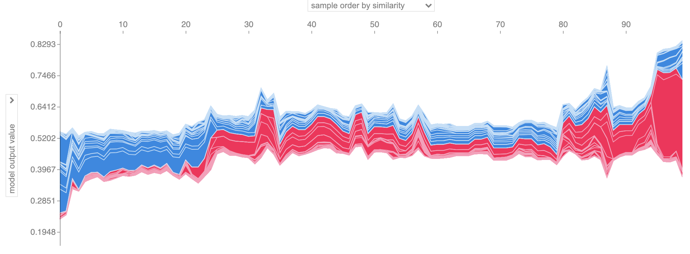
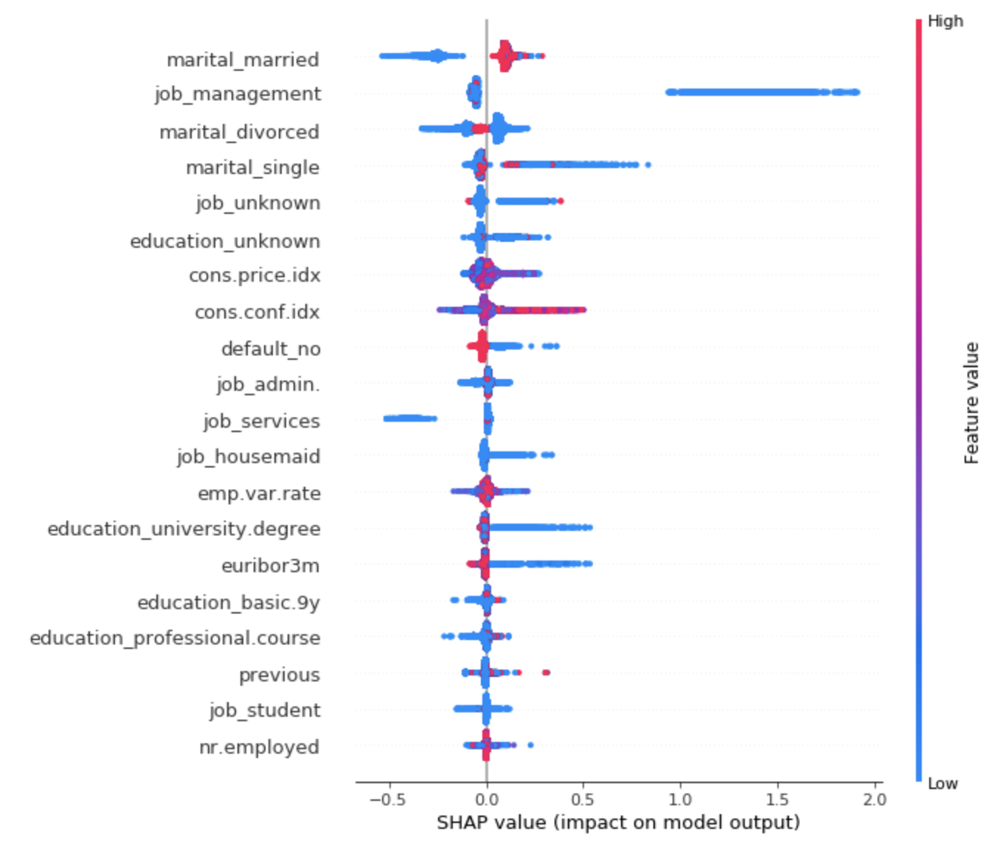

# Amazon SageMaker Autopilot Feature Engineering Transformer and Model Explainability

Amazon SageMaker Autopilot automatically identifies an end-to-end workflow pipeline consisting of data pre-processing, feature engineering, as well as model searching, tuning, and training procedures. The output artifacts can be deployed easily to Amazon SageMaker Hosting Services for operation. Sometimes, however, machine learning tasks may demand more explainability into the pipeline, or just want to leverage a part of the workflow rather than end-to-end. 

amazon-sagemaker-autopilot-feature-engineering-explainability.ipynb provides an example on how to leverage the artifacts generated out of the Amazon SageMaker Autopilot, to achieve data transforming, and model explainability separately. In the notebook, it demonstrates how to map the feature name(s) before and after the feature engineering steps of the Amazon SageMaker Autopilot, which is significant for feature importance interpretation and explainability. Also the notebook illustrates how to enable the Amazon SageMaker Debugger, using the best model hyper-parameters identified by the Amazon SageMaker Autopilot, to generate shapely plot visualisation for global and individual prediction explainabilities.

## Reference
1. [ML Explainability with Amazon SageMaker Debugger](https://aws.amazon.com/blogs/machine-learning/ml-explainability-with-amazon-sagemaker-debugger/)
2. [Amazon SageMaker Autopilot – Automatically Create High-Quality Machine Learning Models With Full Control And Visibility](https://aws.amazon.com/blogs/aws/amazon-sagemaker-autopilot-fully-managed-automatic-machine-learning/)
3. [Amazon SageMaker Solution for explaining credit decisions](https://github.com/awslabs/sagemaker-explaining-credit-decisions)

## License

This library is licensed under the MIT-0 License. See the LICENSE file.